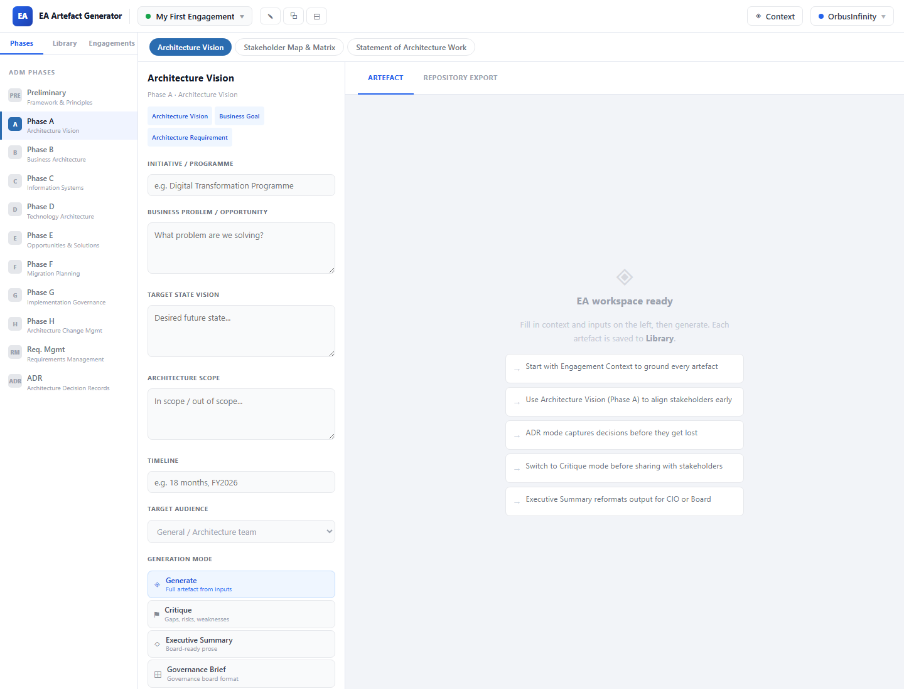

# EA Artefact Generator

Practical enterprise architecture artefact generation workspace for creating structured EA outputs, engagement materials, and export-ready architecture content.

## Purpose

EA Artefact Generator exists to help architecture practitioners turn engagement context into usable enterprise architecture artefacts. It provides a browser-based workspace for capturing engagement information, generating artefact drafts, maintaining an artefact library, and exporting structured architecture objects for repository tools.

The project is part of the Velocity Architecture ecosystem. It is focused on making architecture work concrete: context in, artefacts out, with enough structure to support governance, stakeholder communication, and follow-on repository capture.

## Who It Is For

- Enterprise architects preparing engagement materials and architecture deliverables.
- Solution architects who need structured outputs for governance, decision records, and stakeholder review.
- Architecture teams building reusable artefact libraries across multiple engagements.
- StudioSix and ZenCloudAU delivery work where architecture thinking needs to become working material quickly.

## What It Does

Based on the current application files, the workspace supports:

- Multiple saved engagements persisted in browser local storage.
- Engagement context capture for organisation, initiative, outcomes, stakeholders, assumptions, risks, and constraints.
- Artefact generation modes including generate, critique, executive summary, governance brief, risk analysis, missing decisions, and delivery backlog.
- Audience targeting for roles such as CIO/CTO, CEO/board, program director, delivery manager, security architect, solution architect, procurement, and business owner.
- An artefact library with draft, reviewed, and approved statuses.
- Markdown artefact viewing, copying, and download.
- Repository export objects with CSV download support.
- Export mappings for tools including OrbusInfinity, LeanIX, Ardoq, Sparx EA, Bizzdesign, and generic CSV.

## Live Demo

[EA Artefact Generator](https://ea.velocityarchitecture.com.au/)

## Screenshots





## How It Fits the Ecosystem

EA Artefact Generator is a tooling layer for the Velocity Architecture Framework. Where VAF defines the architecture logic, viewpoints, and governance concepts, this workspace helps practitioners generate and manage the practical outputs that appear during an engagement.

Within the broader ecosystem:

- **Velocity Architecture Framework** provides the architecture method and decision-governance context.
- **VAF-SA** provides the solution architecture delivery altitude and practitioner language.
- **StudioSix** is the commercial delivery wrapper that can use this tool as part of architecture-led AI delivery.
- **ZenCloudAU** is the public GitHub organisation and consulting context for the work.

This repo should remain focused on artefact generation and export-ready architecture content. It should not become the core framework repository.

## Tech Stack

Confirmed from the current files:

- React 19
- React DOM 19
- Vite 8
- JavaScript / JSX
- ESLint
- Cloudflare Vite plugin
- Wrangler
- Static assets in `public/`

Deployment-related files currently present:

- `vite.config.js`
- `wrangler.jsonc`

## How to Run Locally

Commands confirmed from `package.json`:

```bash
npm install
npm run dev
```

Other available scripts:

```bash
npm run build
npm run lint
npm run preview
npm run deploy
```

`preview` and `deploy` both run a build and then use Wrangler.

## Project Status

Usable.

The application has a real workspace UI and implemented artefact/library/export behavior. It is not yet product-ready because license and data-flow documentation are incomplete.

## Roadmap

Near-term improvements:

- Specify the license.
- Document whether generated content is local-only or connected to an external AI/API service.
- Add a short architecture diagram or workflow diagram.
- Add example artefact outputs generated from a safe demo engagement.

## Security and Data Notes

The current workspace persists engagement data in browser local storage. The README does not currently confirm whether generation requires external API configuration or whether all behavior is local/demo-only.

Do not enter confidential client information, private credentials, or regulated data until the data flow and deployment model are explicitly documented.

No secrets are required by the local run commands listed in `package.json`.

## License

License not yet specified.
